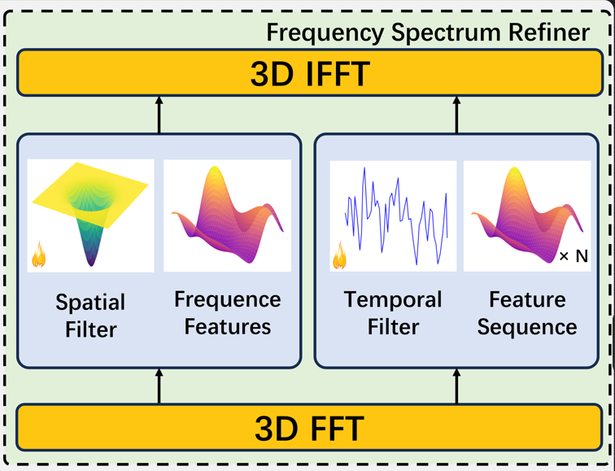

# A frequency filtering network for video representation learning

We propose Video Frequency Filtering Network (ViFi-Net), including three modules for learnable video feature augmentation, representation learning, and feature selection using frequency domain operations.

<br />

<p align="center">
    
    <br />
</p>

```
# code
class FreqAugModule(nn.Module):
    def __init__(self, T, H, W, in_channels, freq_t_co_init=0.1, freq_s_co_init=0.01):
        super(FreqAugModule, self).__init__()
        
        # 可学习时间卷积核 (1D)，大小为 T
        self.time_filter = nn.Parameter(torch.ones(T) * 0.5)  # 初始化为 0.5，接近 HPF
        self.time_filter.data[torch.abs(torch.fft.fftfreq(T)) < freq_t_co_init] = 0.1  # 低频初始化低
        self.time_filter.data = self.time_filter / (self.time_filter.sum() + + 1e-6)  # 归一化
        
        # 可学习空间卷积核 (2D)，大小为 H x W
        self.spatial_filter = nn.Parameter(torch.ones(H, W) * 0.5)  # 初始化为 0.5
        freq_h = torch.fft.fftfreq(H).unsqueeze(1)
        freq_w = torch.fft.fftfreq(W).unsqueeze(0)
        freq_s = torch.sqrt(freq_h ** 2 + freq_w ** 2)
        self.spatial_filter.data[freq_s < freq_s_co_init] = 0.1  # 低频初始化低
        self.spatial_filter.data = self.spatial_filter / (self.spatial_filter.sum() + 1e-6)  # 归一化
        
        # 确保卷积核参数可学习
        self.time_filter.requires_grad = True
        print("1111")
        self.spatial_filter.requires_grad = True
        
        self.in_channels = in_channels

    def forward(self, x):
        B, C, T, H, W = x.shape
        
        # 3D DFT
        x_complex = torch.fft.fftn(x, dim=(2, 3, 4))  # 沿 T, H, W 维度变换
        
        # 广播时间和空间滤波器到 (B, C, T, H, W)
        time_filter_expanded = self.time_filter.view(1, 1, T, 1, 1)  # .repeat(B, C, 1, H, W)
        spatial_filter_expanded = self.spatial_filter.view(1, 1, 1, H, W) #  .repeat(B, C, T, 1, 1)
        
        # 元素-wise 乘法组合滤波
        filter_combined = time_filter_expanded * spatial_filter_expanded
        x_filtered = x_complex * filter_combined
        
        # 3D iDFT
        x_Enhanced = torch.fft.ifftn(x_filtered, dim=(2, 3, 4)).real  # 取实部
        
        # 残差连接
        return x + x_Enhanced  # 残差连接保持原始信息
```

## Contents

- [Directory Structure](#directory-structure)
- [Acknowledgements](#acknowledgements)


## Directory Structure

```

├── LICENSE.txt
├── README.md
├── /data/
├── /network/
├── /pretrained/
├── /run/
├── inference.py
├── mypath.py
└── train.py

```

### Acknowledgements


- [Video-Recognition](https://github.com/jfzhang95/pytorch-video-recognition)

<!-- links -->
